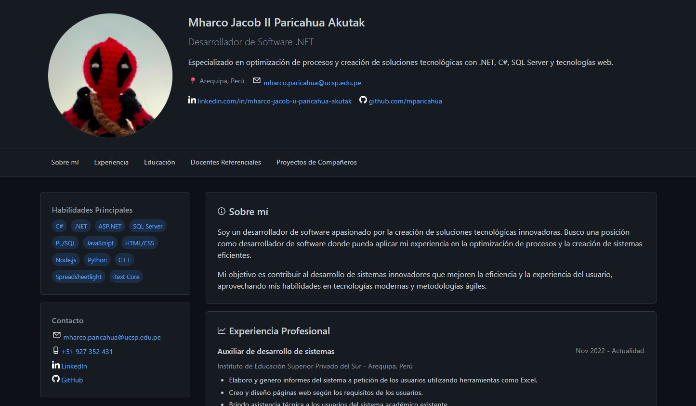

# 🚀 Portafolio Profesional - Mharco Jacob II Paricahua Akutak

[](https://tusuario.github.io)
[](LICENSE)

<p align="center">
  
</p>

## 🌟 Sobre el Proyecto

Portafolio profesional desarrollado como vitrina digital para mostrar mis habilidades, experiencia y proyectos como Desarrollador de Software especializado en tecnologías .NET y web.

## 🛠 Tecnologías Utilizadas


**Herramientas:**
- GitHub Pages para hosting
- Visual Studio Code como editor
- Git para control de versiones

## 📌 Contenido Destacado

1. **Perfil Profesional**
   - Presentación y datos de contacto
   - Especializaciones técnicas
   - Redes profesionales

2. **Experiencia Laboral**
   - Instituto de Educación Superior Privado del Sur
   - Promart Homecenter

3. **Habilidades Técnicas**
   - Lenguajes de programación
   - Frameworks y tecnologías
   - Bases de datos

4. **Educación**
   - Universidad Católica San Pablo
   - Instituto de Educación Superior Privado del Sur

5. **Referencias**
   - Docentes destacados
   - Proyectos de compañeros

## 🚀 Cómo Usar

1. **Visitar el portafolio online:**
   ```bash
   https://mparicahua.github.io/mharcoParicahua.github.io/
